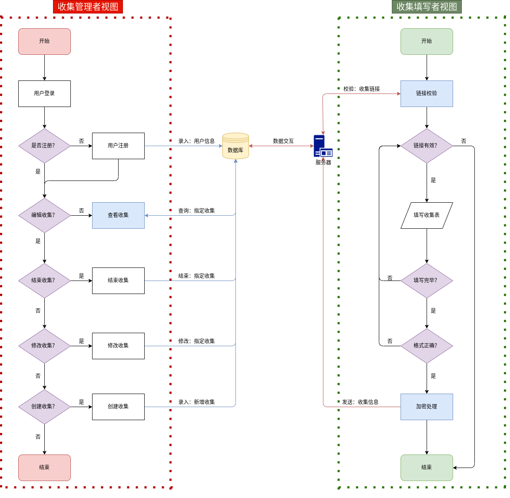

# HUST-SE 2022 Autumn

#### 介绍

华中科技大学计算机学院 2020 级软件工程项目课程设计

作业收集系统，一个帮助学委的小工具

#### 软件功能

- 提交文件自动重命名
- 到期自动汇总提交信息
- 客观题自动评分

#### 项目成员

| 登录名        | 姓名   | 学号       | 分工                                          | 贡献 |
| ------------- | ------ | ---------- | --------------------------------------------- | ---- |
| wang-guangkai | 王广凯 | U202015355 | 实现动态页面设计，协调 Flask 开发             | 25%  |
| ji-shengxiang | 计胜翔 | U202015362 | 实现数据库，提供相应接口，协调配置服务器环境  | 25%  |
| wzx323232     | 王梓熙 | U202015369 | 实现静态页面设计，协调管理用户信息和权限      | 25%  |
| Miraclezjy    | 张隽翊 | U202015374 | 实现 Flask 框架响应设计，搭建服务器并发布页面 | 25%  |

#### 注意事项（完成后删除）

- 仓库可作为 PyCharm 项目打开，源代码位于 `Src` 文件夹
- 代码风格规范参考 [Google 开源项目风格指南](https://zh-google-styleguide.readthedocs.io/en/latest/google-python-styleguide/contents/)。PyCharm 开启 Docstring format 可通过下方路径进行设置，当前设置为 `Google`
  > `文件 -> 设置 -> 工具 -> Python 集成工具 -> Docstrings -> Docstring 格式`
- 目前加入 `.gitignore` 的文件/文件夹有：
  - `.idea/` PyCharm 配置文件
  - `*.db` 数据库文件
  - `*.xml` 项目配置文件
